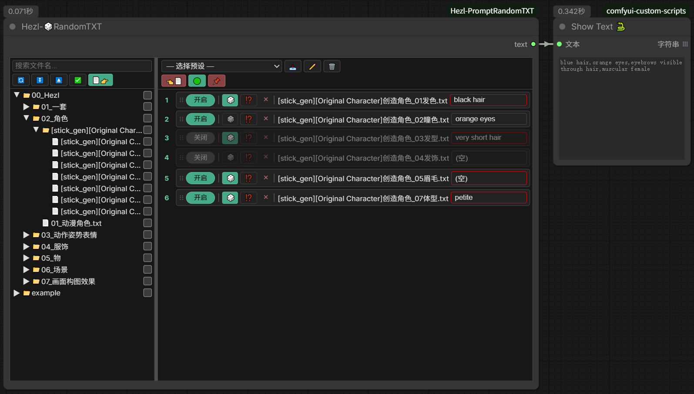

# ComfyUI_Hezl-PromptRandomTXT
Comfyui随机输出TXT文件其中一行为字符.Comfyui randomly outputs a line of characters from a TXT file  


## 功能使用

### 节点概述
节点名：`HezlRandomTXT`（在节点搜索中搜索 `Hezl` 或 `RandomTXT` 可找到）。  
功能：从 `SaveTXT` 目录中挑选一个或多个 txt 文件，每个文件可单独配置输出哪一行（随机或指定），最终按顺序拼接成一个字符串输出，可作为 prompt 供下游节点使用。

### 界面布局
节点界面分为左右两个面板：

- **左侧面板**：目录树浏览器，浏览 `SaveTXT` 文件夹下的所有 txt 文件。
- **右侧面板**：已添加的 txt 文件列表，可配置每个文件的输出方式。
- 中间有可拖拽的分隔条，可调整左右面板宽度。
- 节点右下角可拖拽调整整个节点的高度。

### 左侧目录树
顶部工具栏（从左到右）：

| 按钮 | 功能 |
|------|------|
| 🔄 | 刷新目录树 |
| ⏬️ | 展开所有文件夹 |
| ⏏️ | 收起所有文件夹 |
| ✅️/❎️ | 全选/取消全选当前可见的 txt 文件（全选时显示 ✅️，未全选时显示 ❎️） |
| 📄👉️ | 将勾选的 txt 文件添加到右侧 |

其他操作：
- **搜索框**：输入关键字过滤目录树（不区分大小写）。
- **勾选**：点击文件前的复选框勾选/取消勾选。
- **多选**：
  - `Ctrl+点击`：单独切换某行选中状态。
  - `Shift+点击`：范围多选（从上次选中到当前点击）。
- **悬停提示**：
  - 悬停 txt 文件：显示文件全名。
  - 悬停文件夹：列出里面的子文件夹和 txt 文件名。
- **右键菜单**：在文件/文件夹上右键，可选择"重命名"（内联编辑名称）。
- **排序规则**：同一文件夹内，子文件夹始终排在 txt 文件前面，均按字母（不区分大小写）排序。

### 右侧 txt 文件列表
顶部工具栏分两行：

**第一行（预设管理）**：
| 按钮 | 功能 |
|------|------|
| 选择预设 | 下拉选择已保存的预设 |
| 📥️ | 保存当前配置为新预设（输入名称） |
| ✏️ | 重命名当前选中的预设 |
| 🗑️ | 删除当前选中的预设 |

**第二行（批量操作）**：
| 按钮 | 功能 |
|------|------|
| 👈️📄 | 移除右侧全部 txt 文件（红色背景） |
| 🟢/🔴 | 全开启/全关闭所有 txt 文件的输出（全开时显示 🔴 红色，未全开时显示 🟢 绿色） |
| 🎲/📌 | 全部开启随机/全部关闭随机（有任一 🎲 开启时显示 📌 红色，否则显示 🎲 绿色） |

**单个 txt 文件框**（每个添加的文件一行），从左到右：

| 元素 | 说明 |
|------|------|
| ⋮⋮ | 拖拽手柄，拖动可调整输出顺序 |
| 开启/关闭 | 切换此 txt 是否参与输出（绿色=开启） |
| 🎲 | 随机模式开关。开启时每次执行随机选取一行；关闭时输出下方"词组选择"指定的行。开启后词组按钮边框变红 |
| ⁉️ | 自定义间隔符。设置此 txt 输出与下一个 txt 输出之间的分隔符（最后一项的间隔符不生效） |
| × | 移除此 txt 文件 |
| txt 文件名 | 显示文件名 |
| 词组选择按钮 | 点击弹出选行窗口，选择要输出的那一行。支持搜索过滤 |

**右键菜单**：在 txt 文件框上右键 → "📍 定位文件"，自动在左侧目录树中展开并滚动定位到该文件，绿色高亮 1.2 秒。

### 间隔符设置
点击 ⁉️ 按钮弹出间隔符设置窗口：
- 输入框：自定义任意分隔符
- 快捷选项：`,`、`, `、`、`、` `（空格）、`\n`（换行）、` | `
- "清空"按钮：清空分隔符
- 显示时 `\n` 会显示为可换行形式，保存时自动转换

### 译文支持
- 在 txt 文件旁放置同名 `.txt.tr` 文件（如 `example.txt` 配 `example.txt.tr`）。
- `.tr` 文件按行与原 txt 对应，提供译文显示。
- 词组选择窗口中显示译文（如有），但实际输出的是原 txt 文件中的原文。
- 窗口标题会标注"（译文显示/原文输出）"。

### 预设管理
- 预设保存在 `SavePreset` 文件夹中，为 JSON 格式文件。
- 保存预设时会记录每个 txt 的路径、开启状态、随机状态、所选行号、间隔符。
- 加载预设会还原所有配置。
- 预设可在不同工作流间共享。

### 输出规则
1. 只有"开启"状态的 txt 文件参与输出。
2. 每个 txt 文件根据 🎲 状态决定输出哪一行：
   - 🎲 开启：执行时随机选取一行。
   - 🎲 关闭：输出"词组选择"指定的行。
3. 多个开启的 txt 按列表顺序拼接，相邻两项之间用前一项的间隔符连接。
   - 例：`txt1输出 [间隔符1] txt2输出 [间隔符2] txt3输出`（最后一项的间隔符不生效）。
4. 若无任何开启的 txt，输出空字符串。

### 文件目录结构
```
ComfyUI_Hezl-PromptRandomTXT/
├── SaveTXT/              # txt 文件存放目录（可建子文件夹分类）
│   └── example/
│       ├── example-01.txt
│       ├── example-01.txt.tr   # 可选译文文件
│       └── ...
├── SavePreset/           # 预设保存目录
│   └── .gitkeep
├── js/random_txt.js      # 前端逻辑
└── nodes.py              # 后端逻辑
```

### 使用流程
1. 将 txt 文件放入 `SaveTXT` 目录（可建子文件夹分类）。
2. 在 ComfyUI 中添加 `HezlRandomTXT` 节点。
3. 在左侧目录树勾选需要的 txt 文件，点击 📄👉️ 添加到右侧。
4. 配置每个 txt 的开启状态、随机模式、词组选择、间隔符。
5. 调整顺序（拖拽 ⋮⋮ 手柄）。
6. 可选：保存为预设方便下次使用。
7. 将节点输出连接到 prompt 节点即可。

## 更新
### 预计更新内容
1. 是否加入通配符Wildcard的支持?  
    预设文件可用代替通配符的作用,但老版txt文件大多都使用通配符书写,正在犹豫是否加入支持.


