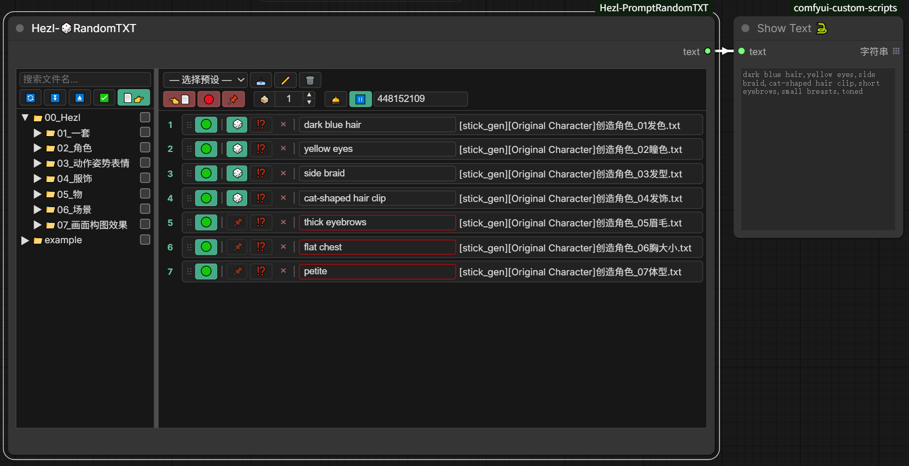

# ComfyUI_Hezl-PromptRandomTXT
Comfyui随机输出TXT文件其中一行为字符.Comfyui randomly outputs a line of characters from a TXT file  


# BUG修复
1. 单个txt文件框的随机模式已开启时,词组选择按钮边框变为红色.

## 功能使用

### 节点概述
节点名：`HezlRandomTXT`（在节点搜索中搜索 `Hezl` 或 `RandomTXT` 可找到）。  
功能：从 `SaveTXT` 目录中挑选一个或多个 txt 文件，每个文件可单独配置输出哪一行（随机或指定），最终按顺序拼接成一个字符串输出，可作为 prompt 供下游节点使用。

### 界面布局
节点界面分为左右两个面板：

- **左侧面板**：目录树浏览器，浏览 `SaveTXT` 文件夹下的所有 txt 文件。
- **右侧面板**：已添加的 txt 文件列表，可配置每个文件的输出方式。
- 中间有可拖拽的分隔条，可调整左右面板宽度。
- 节点右下角可拖拽调整整个节点的高度。

### 左侧目录树
顶部工具栏（从左到右）：

| 按钮 | 功能 |
|------|------|
| 🔄 | 刷新目录树 |
| ⏬️ | 展开所有文件夹 |
| ⏏️ | 收起所有文件夹 |
| ✅️/❎️ | 全选/取消全选当前可见的 txt 文件（全选时显示 ✅️，未全选时显示 ❎️） |
| 📄👉️ | 将勾选的 txt 文件添加到右侧 |

其他操作：
- **搜索框**：输入关键字过滤目录树（不区分大小写）。
- **勾选**：点击文件前的复选框勾选/取消勾选。
- **多选**：
  - `Ctrl+点击`：单独切换某行选中状态。
  - `Shift+点击`：范围多选（从上次选中到当前点击）。
- **悬停提示**：
  - 悬停 txt 文件：显示文件全名。
  - 悬停文件夹：列出里面的子文件夹和 txt 文件名。
- **右键菜单**：在文件/文件夹上右键，可选择"重命名"（内联编辑名称）。
- **排序规则**：同一文件夹内，子文件夹始终排在 txt 文件前面，均按字母（不区分大小写）排序。

### 右侧 txt 文件列表
顶部工具栏分两行：

**第一行（预设管理）**：
| 按钮 | 功能 |
|------|------|
| 选择预设 | 下拉选择已保存的预设 |
| 📥️ | 保存当前配置为新预设（输入名称） |
| ✏️ | 重命名当前选中的预设 |
| 🗑️ | 删除当前选中的预设 |

**第二行**，分三组，组间有明显间距：

**① 批量操作组**：
| 按钮 | 功能 |
|------|------|
| 👈️📄 | 移除右侧全部 txt 文件（红色背景） |
| 🟢/🔴 | 全开启/全关闭所有 txt 文件的输出。全开启时显示 🔴 红色（点击关闭全部），未全开启时显示 🟢 绿色（点击开启全部） |
| 🎲/📌 | 全部开启随机/全部关闭随机。有任一项为随机模式时显示 📌 红色（点击关闭全部随机），全部为固定模式时显示 🎲 绿色（点击开启全部随机） |

**② 合并输出组**（一体组合，无间隙）：
| 元素 | 功能 |
|------|------|
| 🗳️ | 合并随机输出开关（绿色=开启）。开启后忽略常规拼接，从所有已启用 txt 的词组池中随机选取 N 个输出，用 `, ` 连接。开启时所有 txt 文件框边框变黄色 |
| 数量输入框 | 指定 🗳️ 合并随机输出的词组数量（最小 1） |
| ▲▼ | 数量微调按钮，可快速增减合并随机输出数量 |

**③ 种子控制组**：
| 元素 | 功能 |
|------|------|
| 🛎️ | 生成随机种子。点击后在种子输入框填入一个新随机种子，所有 txt 文件框切换为 📌 固定模式，词组按钮显示基于种子随机选出的词组（每次点击种子变化，词组随之变化）。种子值、词组预览与后端实际输出三者完全一致，便于复现 |
| 🔀/⏸️ | 随机种子模式切换。🔀 随机模式（每次执行不同，绿色背景）；⏸️ 固定模式（相同种子输出相同结果，红色背景）。用于图片复现 |
| 种子输入框 | 显示和输入种子值（纯文本，无微调按钮）。随机模式下每次执行后自动更新；固定模式下保持不变 |

**单个 txt 文件框**（每个添加的文件一行），从左到右：

| 元素 | 说明 |
|------|------|
| ⋮⋮ | 拖拽手柄，拖动可调整输出顺序 |
| 🟢/🔴 | 切换此 txt 是否参与输出。🟢 绿色背景=开启（点击关闭）；🔴 灰色背景=关闭（点击开启） |
| 🎲/📌 | 随机模式开关。🎲 绿色背景=随机模式已开启（点击固定当前选择）；📌 红色背景=固定模式（点击开启随机选取一行）。🎲 随机开启时词组选择按钮留空，执行时由后端随机选取一行输出；📌 固定模式时显示已选词组并输出已选词组 |
| ⁉️ | 自定义间隔符。设置此 txt 输出与下一个 txt 输出之间的分隔符（最后一项的间隔符不生效） |
| × | 移除此 txt 文件 |
| txt 文件名 | 显示文件名 |
| 词组选择按钮 | 点击在按钮下方下拉出选行小弹窗，选择要输出的那一行。支持搜索过滤。🎲 随机模式时按钮留空（执行时由后端随机选取一行）；📌 固定模式时显示已选词组并输出已选词组 |

**右键菜单**：在 txt 文件框上右键 → "📍 定位文件"，自动在左侧目录树中展开并滚动定位到该文件，绿色高亮 1.2 秒。

### 间隔符设置
点击 ⁉️ 按钮在按钮下方下拉出间隔符设置小弹窗（锚定到按钮，空间不足时自动翻到上方）：
- 输入框：自定义任意分隔符
- 快捷选项：`,`、`, `、`、`、` `（空格）、`\n`（换行）、` | `
- "清空"按钮：清空分隔符
- 显示时 `\n` 会显示为可换行形式，保存时自动转换
- 点击弹窗外部、按 Esc 或滚动页面均可关闭弹窗
- 弹窗可拖拽顶部标题栏移动到任意位置（词组选择弹窗同理）

### 译文支持
- 在 txt 文件旁放置同名 `.txt.tr` 文件（如 `example.txt` 配 `example.txt.tr`）。
- `.tr` 文件按行与原 txt 对应，提供译文显示。
- 词组选择弹窗中默认显示译文（如有），但实际输出的是原 txt 文件中的原文。
- 弹窗标题会标注"（译文显示/原文输出）"。
- 🌏️ 切换按钮（搜索框左侧）：点击切换显示原文/译文。默认显示译文，切换后显示原文。按钮变绿表示当前为原文模式。无 `.tr` 文件时按钮不可用。

### 预设管理
- 预设保存在 `SavePreset` 文件夹中，为 JSON 格式文件。
- 保存预设时会记录每个 txt 的路径、开启状态、随机状态、所选行号、间隔符。
- 加载预设会还原所有配置。
- 预设可在不同工作流间共享。

### 输出规则
1. 只有"开启"状态的 txt 文件参与输出。
2. 每个 txt 文件根据 🎲 状态决定输出哪一行：
   - 🎲 随机开启：执行时随机选取一行。
   - 📌 固定模式：输出"词组选择"指定的行。
3. **常规模式**（🗳️ 关闭）：多个开启的 txt 按列表顺序拼接，相邻两项之间用前一项的间隔符连接。
   - 例：`txt1输出 [间隔符1] txt2输出 [间隔符2] txt3输出`（最后一项的间隔符不生效）。
4. **合并随机模式**（🗳️ 开启）：从所有已启用 txt 的全部词组中随机选取 N 个（N = 数量输入框的值），用 `, ` 连接输出。忽略常规拼接逻辑和间隔符。
5. 若无任何开启的 txt，输出空字符串。

### 随机种子与图片复现
后端始终使用 `random.Random(seed)` 生成随机数，种子值即实际使用的种子，确保可复现。
- **🔀 随机模式**（默认）：每次执行前由前端生成新随机种子并写入 config，输出每次不同。执行后种子值自动更新到输入框并保存到 config。
- **⏸️ 固定模式**：种子保持不变，相同种子输出相同结果。手动输入种子值后切换到此模式即可锁定。
- **🛎️ 生成随机种子**：点击后生成新随机种子并自动切换为 ⏸️ 固定模式，种子值、词组按钮预览与后端实际输出三者完全一致，便于复现。
- **图片复现**：ComfyUI 会将工作流（含种子值和 config）保存到 PNG 元数据中。拖放图片到 ComfyUI 还原工作流后，种子值和配置不变，重新执行即可得到相同的提示词输出（🔀/⏸️ 两种模式下均生效）。
- 种子值和模式（🔀/⏸️）会保存到预设中。
- **🎲 随机模式下的输出**：🎲 随机开启时，词组选择按钮留空（不显示具体词组），执行时由后端基于种子随机选取一行输出。相同种子下输出一致，确保图片复现可靠。前端内置了与 CPython `random.Random` 字节级一致的 MT19937 实现（`PyRandom` 类，支持 0 ~ 2^53 种子），保留以备未来预览功能复用。

### 文件目录结构
```
ComfyUI_Hezl-PromptRandomTXT/
├── SaveTXT/              # txt 文件存放目录（可建子文件夹分类）
│   └── example/
│       ├── example-01.txt
│       ├── example-01.txt.tr   # 可选译文文件
│       └── ...
├── SavePreset/           # 预设保存目录
│   └── .gitkeep
├── js/random_txt.js      # 前端逻辑
└── nodes.py              # 后端逻辑
```

### 使用流程
1. 将 txt 文件放入 `SaveTXT` 目录（可建子文件夹分类）。
2. 在 ComfyUI 中添加 `HezlRandomTXT` 节点。
3. 在左侧目录树勾选需要的 txt 文件，点击 📄👉️ 添加到右侧。
4. 配置每个 txt 的开启状态、随机模式、词组选择、间隔符。
5. 调整顺序（拖拽 ⋮⋮ 手柄）。
6. 可选：保存为预设方便下次使用。
7. 将节点输出连接到 prompt 节点即可。

## 更新日志

### 260724
1. 修复切换到 📌 固定模式时 📌 按钮跑到 ⋮⋮ 拖拽手柄位置并与 🟢/🔴 开关重叠的 BUG。
    - 根因：diceBtn 固定模式用的 CSS 类名 `fixed` 与 ComfyUI 全局样式 `.fixed{position:fixed}` 冲突。切到固定模式加上 `fixed` 类后，按钮被 `position:fixed` 移出 flex 流，静态位置回退到行首（拖拽手柄处），于是 📌 偏移并重叠 🟢/🔴 开关。随机模式用的 `active` 类全局无规则，故正常。
    - 修复：将 diceBtn 的状态类命名空间化为 `dice-active`/`dice-fixed`，避免与全局工具类冲突。
2. 修复右侧列表重渲染时滚动位置被重置的潜在问题。
    - `renderItems` 用 `innerHTML=""` 重建列表会清零容器的 `scrollTop/scrollLeft`，窄面板横向溢出或长列表纵向滚动时，点击 🎲/📌、开关、删除等触发重渲染后视口会跳回首端。重渲染前保存、重建后恢复滚动位置，消除跳动。
3. "选择词组（译文显示/原文输出）"和"间隔符号"弹窗改为下拉小弹窗。
    - 由原居中遮罩大弹窗改为锚定到触发按钮下方的轻量下拉小弹窗（`.hezl-popover`），下方空间不足时自动翻到按钮上方，并贴边校正。
    - 词组选择弹窗的列表区独立滚动（最大 50vh），头部与搜索框保持固定。
    - 点击弹窗外部、按 Esc、或滚动页面均可关闭弹窗（弹窗内部滚动不触发关闭）。
4. 小弹窗支持拖拽顶部移动位置。
    - 按住弹窗顶部标题栏（标题文字区域）拖拽可移动整个弹窗到任意位置；关闭按钮 × 不会触发拖拽。
    - 拖拽后弹窗不再随触发按钮锚定，搜索过滤或切换译文时仅做贴边校正保持可见，不会跳回按钮下方。
    - 拖拽有边界限制：至少保留 60px 宽度与标题栏可见，保证能拖回。关闭后重新打开恢复锚定定位。

### 260722
1. 工具栏第二行分组布局优化。
    - 分为三组（批量操作 / 合并输出 / 种子控制），组间 12px 间距，组内 3px 紧凑排列。
    - 🗳️、数量输入框、▲▼ 微调按钮组合为一体（无间隙），去除两侧分隔线。
    - 数量输入框右侧新增 ▲▼ 微调按钮，可快速增减合并随机输出数量。
    - 种子输入框为纯文本输入（无微调按钮）。
2. txt 文件框内按钮图标优化。
    - 开启/关闭按钮：文字"开启/关闭"改为图标 🟢/🔴，方形按钮，更直观紧凑。
    - 随机模式按钮：由固定 🎲 改为 🎲/📌 切换。🎲 绿色底=随机模式开启（点击固定当前选择）；📌 灰色底=固定模式（点击开启随机）。
3. 词组选择按钮显示逻辑调整。
    - 🎲 随机模式开启时：词组按钮留空（不显示具体词组），执行时由后端基于种子随机选取一行输出。移除之前的红色边框效果和前端预计算预览。
    - 📌 固定模式时：显示已选词组并输出已选词组（原行为）。
    - 前端 `PyRandom` 类（MT19937 实现）和 `computePreviewLines` 函数保留以备未来复用，当前 UI 不再调用。

### 260721
1. 词组选择按钮显示实际输出内容（🎲 随机预览）。
    - 🎲 开启时，按钮显示基于当前种子预计算出的随机结果，与后端 `execute()` 实际输出那一行完全一致。
    - 前端内置与 CPython `random.Random` 字节级一致的 MT19937 实现（`PyRandom` 类），支持 0 ~ 2^53 种子，无需请求后端即可预计算。
    - 🎲 关闭时，按钮显示手动选择的行（原行为）。
    - 预览随种子输入、启用状态、🎲 切换实时更新；执行后种子更新时预览同步刷新。
2. 修复随机模式下"图片复现"不生效的潜在 BUG。
    - 根因：后端 `execute()` 在随机模式下用 `random.Random()`（系统熵），忽略前端生成并保存到 config 的种子，导致 PNG 元数据中的种子从未被使用。
    - 修复：后端始终使用 `random.Random(seed)`，随机模式仅表示"前端每次执行前生成新种子"。两种模式下 PNG 元数据中的种子均为实际使用的种子，拖放图片复现输出完全一致。
3. `/file` 接口返回的行与 `execute()` 严格一致。
    - 对每行做 `strip()` 并过滤空行，`.tr` 译文按 `.txt` 非空行对齐，保证前端缓存的行数组与后端 `choice`/索引使用的行数组完全相同，使预计算结果准确。
4. 修复节点在 Nodes 2.0 中无限向下拉伸的 BUG。
    - 根因：`requestAnimationFrame` 循环设置 `container.style.height`，在 Nodes 2.0 中形成反馈循环（widget高度→节点高度→widget高度→无限增长）。
    - 修复：改用 `getMinHeight`+`getMaxHeight`+`getHeight` 三函数返回 `node._widgetHeight`，配合 `onResize` 同步，同时兼容旧前端和 Nodes 2.0。
5. 节点显示区域高度跟随节点大小变化（旧前端 + Nodes 2.0 双兼容）。
6. 新增 🛎️ 生成随机种子按钮（位于 🔀/⏸️ 前）。
    - 点击后生成新随机种子填入种子输入框，所有 txt 文件框的 🎲 词组预览随之刷新，模式自动切换为 ⏸️ 固定模式。
    - 确保种子值、词组按钮预览、后端 `execute()` 实际输出三者完全一致，便于复现。

### 260720
1. 新增随机种子功能。
    - 🔀 随机模式：每次执行输出不同。
    - ⏸️ 固定模式：相同种子输出相同结果，可用于图片复现。
    - 种子值保存到 config 和预设中，拖放图片复现工作流时种子一致。
2. 新增合并随机输出词组功能。
    - 🗳️ 开关：开启后从所有已启用 txt 的词组池中随机选取 N 个输出。
    - 输入框指定输出词组数量。
    - 开启时所有 txt 文件框边框变黄色。
3. 右侧第二行新增种子控制：🔀/⏸️ 切换 + 种子输入框。
4. 词组选择弹窗新增 🌏️ 原文/译文切换按钮。
5. 去除所有影响性能的动画和显示效果（box-shadow、transition、smooth scroll）。

### 260719
1. 右侧 txt 文件框新增右键菜单"📍 定位文件"功能。
    - 点击后自动展开左侧目录树父文件夹，滚动定位到对应文件，绿色高亮 1.2 秒。
2. 目录树排序修复：子文件夹始终排在 txt 文件前面，按字母不区分大小写排序。
3. 目录树悬停提示：
    - 悬停 txt 文件显示文件全名。
    - 悬停文件夹列出内部所有子文件夹和 txt 文件名。
4. 右侧第二行新增 🎲/📌 全部开启随机/全部关闭随机按钮。
5. 从目录树添加 txt 文件时默认开启 🎲 随机和"开启/关闭"按钮。
6. txt 文件框按钮调整：移除按钮（×）移至 ⁉️ 后面、txt 文件名前面。
7. 词组选择按钮宽度固定 200px，文件名占剩余空间。

### 260718
1. 右侧顶部工具栏分为两行布局。
    - 第一行：选择预设 | 📥️ 保存 | ✏️ 重命名 | 🗑️ 删除。
    - 第二行：👈️📄 移除全部 | 🟢/🔴 全开启/全关闭 | 🎲/📌 全部随机。
2. 左侧目录树顶部按钮图标替换：🔄 刷新 | ⏬️ 展开 | ⏏️ 收起 | ✅️/❎️ 全选 | 📄👉️ 添加。
3. 修复节点无法拖拽右下角变更高度的 BUG。
4. 修复节点窗口无法占满整个节点的 BUG。
5. 新增自定义间隔符功能（⁉️ 按钮），每个 txt 可独立设置与下一个 txt 输出之间的分隔符。
6. 翻译文件从 `.txt.zh` 改为 `.txt.tr`，适配所有语言。
7. 🎲 按钮开启时词组选择按钮边框变红色。

## 预计更新内容
1. 是否加入通配符Wildcard的支持?  
    预设文件可用代替通配符的作用,但老版txt文件大多都使用通配符书写,正在犹豫是否加入支持.
2. 可以自定义txt每行输出的前后符号,取消原本的"自定义与下一个txt文件符号"
3. 增加开启权重按钮,开启后会将输出的加上权重符号.
