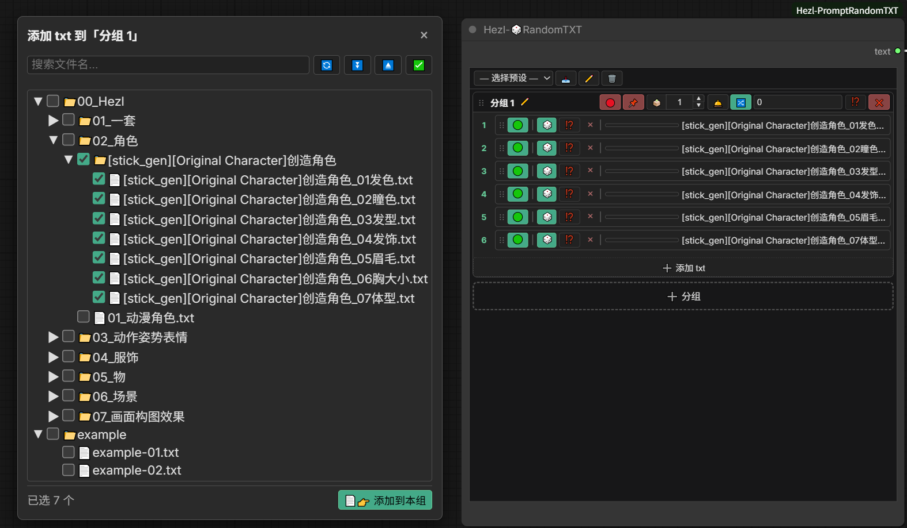

# ComfyUI_Hezl-PromptRandomTXT
Comfyui随机输出TXT文件其中一行为字符.Comfyui randomly outputs a line of characters from a TXT file  


## 功能使用

### 节点概述
节点名：`HezlRandomTXT`（在节点搜索中搜索 `Hezl` 或 `RandomTXT` 可找到）。  
功能：从 `SaveTXT` 目录中挑选一个或多个 txt 文件，每个文件可单独配置输出哪一行（随机或指定），按分组组织，每个分组独立配置种子/合并/间隔符，各组输出按顺序拼接成一个字符串输出，可作为 prompt 供下游节点使用。

### 界面布局
节点界面为单个面板，占满整个节点宽度：

- **分组列表面板**：分组列表，每个分组是一个独立配置单元，包含各自的 txt 文件列表与种子/合并/间隔符设置。
- 每个分组框底部有「➕ 添加 txt」虚线按钮，点击弹出目录树小窗口选择文件添加到该分组。
- 节点右下角可拖拽调整整个节点的高度。

### 目录树弹窗
点击分组框底部的「➕ 添加 txt」按钮后，弹出目录树小窗口（下拉弹窗，可拖拽移动）。

> **宽高自适应**：弹窗宽度按目录树中最长的文件名（含缩进层级）撑开，高度按可见行数撑开——文件名短/少时弹窗小巧，文件名长/多时弹窗变宽变高（宽度上限 80vw，树高度上限 55vh，超出后内部滚动）。搜索过滤、展开/收起文件夹后弹窗尺寸会随之变化，并自动贴边校正避免溢出视口。文件名完整显示不截断。

弹窗内从上到下：
1. **标题栏**：显示"添加 txt 到「分组名」"，可拖拽移动弹窗。
2. **工具栏**：搜索框 + 刷新 + 展开 + 收起 + 全选按钮。

| 按钮 | 功能 |
|------|------|
| 搜索框 | 输入关键字过滤目录树（不区分大小写） |
| 🔄 | 刷新目录树（重新读取 SaveTXT 文件夹） |
| ⏬️ | 展开所有文件夹 |
| ⏏️ | 收起所有文件夹 |
| ✅️/🟩 | 全选/取消全选当前可见的 txt 文件（全选时显示 🟩，未全选时显示 ✅️） |

3. **目录树**：浏览 `SaveTXT` 文件夹下的所有 txt 文件，可滚动。
4. **底部栏**：显示已选数量 + 「📄👉️ 添加到本组」按钮。

其他操作：
- **勾选位置**：txt 文件的勾选框在文件名前面（图标前）；文件夹的勾选框在图标前面（展开三角形后）。
- **勾选 txt**：点击 txt 文件（文件名/图标/行空白）即可切换勾选状态，不必只点勾选框；点击勾选框同样切换。
- **文件夹勾选**：仅点击文件夹的勾选框才勾选（联动选中/取消其下所有 txt 文件）。
- **展开文件夹**：点击文件夹（展开三角形/图标/名称/行空白）即可展开/收起，不必只点三角形；点击勾选框只切换选中不展开。
- **多选**：
  - `Ctrl+点击`：单独切换某行选中状态。
  - `Shift+点击`：范围多选（从上次选中到当前点击）。
- **悬停提示**：
  - 悬停 txt 文件：显示文件全名。
  - 悬停文件夹：列出里面的子文件夹和 txt 文件名。
- **右键菜单**：在文件/文件夹上右键，可选择"重命名"（内联编辑名称）。
- **排序规则**：同一文件夹内，子文件夹始终排在 txt 文件前面，均按字母（不区分大小写）排序。
- 点击弹窗外部、按 Esc 或滚动页面均可关闭弹窗。

### 右侧分组列表
右侧顶部只有一行工具栏，之后是分组列表（可滚动）。

**顶部工具栏**：
| 按钮 | 功能 |
|------|------|
| 选择预设 | 下拉选择已保存的预设 |
| 📥️ | 保存当前配置为新预设（输入名称） |
| ✏️ | 重命名当前选中的预设 |
| 🗑️ | 删除当前选中的预设 |

**分组框**（每个分组用一个带边框的框区分，分组头部有 ▶/▼ 折叠按钮，点击可折叠/展开本组 txt 显示区域；所有批量操作按钮都在框内，各分组独立配置）。每个分组框分为顶部按钮栏和下方 txt 显示区域。**每个分组最多显示 10 个 txt 文件框，超出部分需下拉滚动条查看**。分组列表最下方有一个虚线框的「➕ 分组」按钮用于新增分组。**允许 0 个分组**：可删除全部分组（删除前会确认），此时分组列表仅显示空状态提示与「➕ 分组」按钮；新建节点默认带 1 个「默认分组」，加载已保存配置时按保存的分组数量还原（保存为 0 个则显示 0 个，不自动补）。

分组框顶部按钮栏从左到右，分为「拖拽手柄 | 折叠按钮 | 分组名+✏️」（左侧）与「工具栏按钮组」（右侧，中间留白隔开）两部分：

| 元素 | 功能 |
|------|------|
| ⋮⋮ | 分组拖拽手柄，拖动可**改变分组顺序**（分组框之间重新排序） |
| ▶/▼ | 折叠/展开此分组。折叠后隐藏本组 txt 列表与「➕ 添加 txt」按钮，仅保留顶部按钮栏（折叠状态随工作流/预设保存） |
| 分组名 | 双击重命名分组（宽度自适应内容，过长省略） |
| ✏️ | 重命名分组（与分组名紧邻，与其他按钮隔开） |
| 🟢/🔴 | 全开启/全关闭本分组 txt 输出。全开启时显示 🔴 红色（点击关闭全部），未全开启时显示 🟢 绿色（点击开启全部） |
| 🎲/📌 | 全部开启随机/全部关闭随机（仅本分组）。有任一项为随机模式时显示 📌 红色（点击关闭全部随机），全部为固定模式时显示 🎲 绿色（点击开启全部随机） |
| 🗳️ + 数量 + ▲▼ | 本组合并随机输出开关与数量（一体组合）。开启后本组忽略常规拼接，从本组已启用 txt 的词组池随机选取 N 个用 `, ` 连接输出；开启时本组所有 txt 文件框边框变黄色 |
| 🛎️ | 生成本组随机种子：填入新种子、切到固定模式，用种子计算随机行并固定为已选词组（selected_line），本组所有 txt 变为 📌 固定模式。📌 词组随种子变化（不同种子显示不同词组） |
| 🔀/⏸️ | 本组种子模式切换。🔀 随机模式（每次执行不同，绿色）；⏸️ 固定模式（相同种子输出相同结果，红色） |
| 种子输入框 | 本组种子值（纯文本）。随机模式下每次执行后自动更新；固定模式下保持不变 |
| ⁉️ | 本组输出与下一组输出之间的组间分隔符（最后一个分组的此项不生效） |
| ❌ | 删除此分组（可删除至 0 个分组，删除前会确认） |

> 移除单组全部 txt：通过逐个点击 txt 文件框的 × 按钮删除（已移除原 👈️📄 批量移除按钮）。

**单个 txt 文件框**（每个添加的文件一行），从左到右：

| 元素 | 说明 |
|------|------|
| ⋮⋮ | 拖拽手柄，拖动可调整顺序，**支持跨分组拖拽**（可拖到另一个分组的某个位置插入，也可拖到空白区域或空分组追加到末尾） |
| 🟢/🔴 | 切换此 txt 是否参与输出。🟢 绿色背景=开启（点击关闭）；🔴 灰色背景=关闭（点击开启） |
| 🎲/📌 | 随机模式开关。🎲 绿色背景=随机模式（点击切换到 📌 固定模式）；📌 红色背景=固定模式（点击切换到 🎲 随机模式）。🎲 随机模式时词组选择按钮显示为空（执行时随机选一行）；📌 固定模式时显示已选词组并输出已选词组 |
| ⁉️ | 自定义间隔符。设置此 txt 输出与下一个 txt 输出之间的分隔符（本组最后一项的间隔符不生效） |
| × | 移除此 txt 文件 |
| txt 文件名 | 显示文件名 |
| 词组选择按钮 | 点击在按钮下方下拉出选行小弹窗，选择要输出的那一行。支持搜索过滤。🎲 随机模式时显示为空；📌 固定模式时显示已选词组。在 🎲 随机模式下选词组会自动切到 📌 固定模式并显示选中词组 |

**右键菜单**：在 txt 文件框上右键 → "📍 定位文件"，自动打开目录树弹窗（若未打开，锚定到该文件框下方，定位到所属分组），展开父文件夹并滚动定位到该文件，绿色高亮 1.2 秒。

**添加 txt 到分组**：点击分组框底部的「➕ 添加 txt」虚线按钮，弹出目录树小窗口。在目录树中勾选 txt 文件后点击底部「📄👉️ 添加到本组」按钮，文件即添加到该分组。同路径文件不重复添加。

**新增分组**：点击分组列表最下方的虚线框「➕ 分组」按钮，在末尾新增一个空分组。

### 间隔符设置
点击 ⁉️ 按钮在按钮下方下拉出间隔符设置小弹窗（锚定到按钮，空间不足时自动翻到上方）：
- 输入框：自定义任意分隔符
- 快捷选项：`,`、`, `、`、`、` `（空格）、`\n`（换行）、` | `
- "清空"按钮：清空分隔符
- 显示时 `\n` 会显示为可换行形式，保存时自动转换
- 点击弹窗外部、按 Esc 或滚动页面均可关闭弹窗
- 弹窗可拖拽顶部标题栏移动到任意位置（词组选择弹窗同理）

### 译文支持
- 在 txt 文件旁放置同名 `.txt.tr` 文件（如 `example.txt` 配 `example.txt.tr`）。
- `.tr` 文件按行与原 txt 对应，提供译文显示。
- 词组选择弹窗中默认显示译文（如有），但实际输出的是原 txt 文件中的原文。
- 弹窗标题会标注"（译文显示/原文输出）"。
- 🌏️ 切换按钮（搜索框左侧）：点击切换显示原文/译文。默认显示译文，切换后显示原文。按钮变绿表示当前为原文模式。无 `.tr` 文件时按钮不可用。

### 预设管理
- 预设保存在 `SavePreset` 文件夹中，为 JSON 格式文件。
- 保存预设时会记录每个 txt 的路径、开启状态、随机状态、所选行号、间隔符。
- 加载预设会还原所有配置。
- 预设可在不同工作流间共享。

### 输出规则
1. 只有"开启"状态的 txt 文件参与输出。
2. 每个 txt 文件根据 🎲 状态决定输出哪一行：
   - 🎲 随机开启：执行时由本组种子对应的 RNG 随机选取一行。
   - 📌 固定模式：输出"词组选择"指定的行。
3. **组内常规模式**（本组 🗳️ 关闭）：本组多个开启的 txt 按列表顺序拼接，相邻两项之间用前一项的间隔符连接。
   - 例：`txt1输出 [间隔符1] txt2输出 [间隔符2] txt3输出`（本组最后一项的间隔符不生效）。
4. **组内合并随机模式**（本组 🗳️ 开启）：从本组所有已启用 txt 的全部词组中随机选取 N 个（N = 本组数量输入框的值），用 `, ` 连接输出。忽略组内常规拼接逻辑和间隔符。
5. **组间拼接**：各分组的输出按分组顺序，用"前一个分组的组间分隔符（⁉️）"连接成最终单 STRING 输出。
   - 例：`分组1输出 [组间分隔符1] 分组2输出 [组间分隔符2] 分组3输出`（最后一个分组的组间分隔符不生效）。
6. 若所有分组均无输出，输出空字符串。

### 随机种子与图片复现
后端为每个分组独立创建 `random.Random(group.seed)` 生成随机数，各组种子互不影响。
- **🔀 随机模式**（默认）：每次执行前由前端为该组生成新随机种子并写入 config，输出每次不同。执行后该组种子值自动更新到输入框并保存到 config。
- **⏸️ 固定模式**：该组种子保持不变，相同种子输出相同结果。手动输入种子值后切换到此模式即可锁定。
- **🛎️ 生成本组随机种子**：点击后为本组生成新随机种子并自动切换为 ⏸️ 固定模式，本组所有 txt 变为 📌 固定模式，**📌 词组随种子变化**——用新种子镜像后端 `rng.choice` 顺序算出随机行并固定为 `selected_line`，不同种子显示不同词组，与后端实际输出一致，便于复现。
- **图片复现**：ComfyUI 会将工作流（含各组种子值和 config）保存到 PNG 元数据中。拖放图片到 ComfyUI 还原工作流后，各组种子值和配置不变，重新执行即可得到相同的提示词输出（🔀/⏸️ 两种模式下均生效）。
- 各组种子值和模式（🔀/⏸️）会保存到预设中。
- **🎲 随机模式词组按钮显示为空**：🎲 随机模式时词组选择按钮显示为空（执行时由后端基于本组种子 `rng.choice` 随机选一行输出，不在前端显示预览）；📌 固定模式时显示 `selected_line` 对应的已选词组。前端内置与 CPython `random.Random` 字节级一致的 MT19937 实现（`PyRandom` 类，支持 0 ~ 2^53 种子），仅供 🛎️ 按钮计算随机行用，不用于 🎲 模式显示，不修改用户手动固定的词组。

### 文件目录结构
```
ComfyUI_Hezl-PromptRandomTXT/
├── SaveTXT/              # txt 文件存放目录（可建子文件夹分类）
│   └── example/
│       ├── example-01.txt
│       ├── example-01.txt.tr   # 可选译文文件
│       └── ...
├── SavePreset/           # 预设保存目录
│   └── .gitkeep
├── js/random_txt.js      # 前端逻辑
└── nodes.py              # 后端逻辑
```

### 使用流程
1. 将 txt 文件放入 `SaveTXT` 目录（可建子文件夹分类）。
2. 在 ComfyUI 中添加 `HezlRandomTXT` 节点。
3. 点击分组框底部的「➕ 添加 txt」按钮，在弹出的目录树小窗口中勾选需要的 txt 文件，点击「📄👉️ 添加到本组」添加到该分组。
4. 配置每个 txt 的开启状态、随机模式、词组选择、间隔符。
5. 调整顺序（拖拽 ⋮⋮ 手柄，支持跨分组拖拽）。
6. 按需新增分组（列表底部虚线「➕ 分组」按钮）、重命名分组（双击分组名）、删除分组（❌）。
7. 各分组独立配置种子（🛎️/🔀/⏸️）、合并输出（🗳️）、组间分隔符（⁉️）。
8. 可选：保存为预设方便下次使用。
9. 将节点输出连接到 prompt 节点即可。

## 更新日志

### 261007
1. 修复 UTF-16 编码的 txt 词组为空的问题。
    - 根因：txt 若以记事本「Unicode」（UTF-16 LE + BOM）保存，后端按 UTF-8 打开会抛 `UnicodeDecodeError`；`/hezl_randomtxt/file` 返回的是无 `lines` 字段的错误响应（前端 `data.lines || []` 回退为空数组），`execute()` 也因 `except Exception: continue` 跳过该文件。
    - 新增 `_read_text()`：按 BOM 识别编码，`FF FE`/`FE FF` 按 `utf-16` 解码，其余按 `utf-8-sig`（顺带去掉 UTF-8 BOM）。`/hezl_randomtxt/file`（含 `.tr` 译文）与 `execute()` 统一改用它读取。
    - 原有 UTF-8 txt 的读取结果不变，前端与后端仍使用同一套按行结果（strip + 过滤空行）。

### 260809
1. 每个分组新增折叠/展开功能。
    - 分组头部新增 ▶/▼ 折叠按钮（位于拖拽手柄与分组名之间），点击切换本组 txt 列表的显示/隐藏。
    - 折叠后隐藏本组 items 区域与组内「➕ 添加 txt」按钮，仅保留分组头部（拖拽手柄/分组名/全部批量操作按钮仍可用），节点整体高度不变。
    - 折叠状态随工作流/PNG/预设保存（`serializeState` 序列化 `collapsed` 字段，`restoreState` 已支持读取），重新加载时按保存状态还原。
    - 折叠时不渲染 items 并跳过 maxHeight 计算（`display:none` 子树中 `offsetTop` 恒为 0，直接计算会把 maxHeight 错误设为 4px，展开后 items 区域将卡死）；展开时重新渲染并恢复「最多显示 10 项」上限逻辑。

### 260731
1. 移除左侧目录树面板，改为分组框底部的「➕ 添加 txt」弹窗。
    - 去除原左侧目录树面板和中间分隔条，右侧分组列表占满整个节点宽度。
    - 每个分组框底部新增虚线「➕ 添加 txt」按钮，点击后弹出目录树小窗口（`.hezl-tree-popover`），包含搜索框、刷新/展开/收起/全选按钮、目录树、已选数量和「📄👉️ 添加到本组」按钮。
    - 目录树弹窗可拖拽顶部标题栏移动，点击外部/Esc/滚动关闭。
    - `node._hezl_tree_el`/`_hezl_select_all_btn`/`_hezl_tree_count` 在弹窗打开时动态设置、关闭时通过 `popover._onClose` 回调清空，`renderTree` 等函数无需修改即按需渲染到弹窗。
    - `buildUI` 移除左侧面板和分隔条创建代码，初始加载仅预取 `state.tree` 数据不再渲染树（弹窗打开时按需渲染）。
2. 每个分组最多显示 10 个 txt 文件框，超出部分滚动查看。
    - `renderGroupItems` 渲染后检测 item 数量，超过 10 项时用第 11 项的 `offsetTop`（相对于 `.hezl-group-body`）计算恰好显示 10 项的 `maxHeight` 并设为内联样式，第 11 项起需下拉滚动条查看。
    - ≤10 项时清除内联 `maxHeight`，回退到 CSS `max-height:50vh`（通常不触发滚动）。
    - `.hezl-group-body` 新增 `position:relative`，使子元素 `offsetTop` 相对于容器，确保测量准确。
3. 修复「📍 定位文件」在目录树弹窗未打开时无响应的问题。
    - `locateFileInTree` 原依赖常驻左侧面板的 `node._hezl_tree_el`，UI 重构后弹窗关闭时该引用为空，导致右键"定位文件"静默失效。
    - 改为：弹窗未打开时先调 `openTreePopover(node, gi, anchorEl)` 打开弹窗（锚定到所点击的 txt 文件框下方，定位到其所属分组），再展开父文件夹、滚动定位并绿色高亮 1.2 秒；弹窗已打开时维持原有渲染+滚动逻辑。
    - `showItemContextMenu`/`locateFileInTree` 新增 `gi` 与 `anchorEl` 参数，由 `contextmenu` 监听器从所在分组与行元素传入；`state.searchText` 在打开弹窗前清空，确保弹窗内搜索框初始化为空、目标文件可见。
    - `state.tree` 未就绪时先 `await fetchTree()` 拉取（通常 `buildUI` 初始化已预取，仅作兜底）。
4. 允许 0 个分组。
    - 移除「至少保留一个分组」限制：`deleteGroup` 不再拦截最后一个分组的删除，可删除至 0 个。
    - `renderGroups`/`restoreState` 不再在 `state.groups.length === 0` 时自动补「默认分组」——保存的 config 有几个分组就显示几个。
    - 新建节点（无保存 config）仍由 `getState` 初始化 1 个「默认分组」；加载已保存配置时按保存数量还原（含 0 个）。
    - 0 分组时分组列表显示空状态提示（`.hezl-groups-empty`）+「➕ 分组」按钮。
    - 后端 `execute()` 本就兼容空 groups（`group_outputs` 为空时返回空串），无需改动。
5. 目录树弹窗宽高随内容自适应。
    - `.hezl-tree-popover` 改为 `width: max-content`（min 300px / max 80vw），宽度由目录树中最长文件名（含缩进层级）撑开；`overflow: visible`，滚动交由内部树容器处理，避免弹窗自身滚动条挤占宽度。
    - `.hezl-tree-popover-tree` 改为 `flex: 1 1 auto`（min 80px / max 55vh），高度随可见行数撑开，超出后内部滚动。
    - `.hezl-tree-popover .hezl-tree-name` 取消 `overflow:hidden`+`text-overflow:ellipsis`，文件名完整显示不截断，以驱动宽度。
    - 修复 CSS 特异性问题：原 `.hezl-tree-popover`（0,1,0）声明在基类 `.hezl-popover`（0,1,0）之前，导致基类的 `max-width:340px`/`overflow-y:auto` 等胜出，弹窗被锁在 340px。改为 `.hezl-popover.hezl-tree-popover`（0,2,0）提升特异性，确保 min/max-width、overflow 等覆盖基类。
    - 新增 `clampTreePopoverOnScreen`：`renderTree` 末尾调用，宽度变化后仅做贴边校正（不重新锚定按钮），避免搜索/展开/收起后弹窗溢出视口右侧或下侧。
6. 目录树勾选框位置与点击交互优化。
    - 勾选框位置：txt 文件的勾选框从文件名后移到文件名前（spacer 后、icon 前）；文件夹的勾选框从名称后移到图标前（toggle 后、icon 前）。两类行勾选框列对齐。
    - txt 点击即勾选：点击 txt 文件（文件名/图标/行空白）切换勾选状态，不必只点勾选框；shift+点击仍支持范围多选。
    - 文件夹点击即展开：点击文件夹（三角形/图标/名称/行空白）展开/收起，不必只点三角形；点击勾选框仅切换选中（联动子 txt）不展开。
    - 修复潜在 BUG：原文件行 click 处理器引用了 `toggle`（仅在文件夹分支声明的块级变量），文件分支访问会抛 ReferenceError，导致点击 txt 文件名切换勾选失效。移除该引用后正常。
    - `.hezl-tree-row` 的 `cursor` 由 `default` 改为 `pointer`，提示整行可点击。
    - 文件夹展开/收起后调 `clampTreePopoverOnScreen` 贴边校正，避免可见行数变化导致弹窗溢出视口下侧。

### 260726
1. 右侧改为多分组结构（方案A：各组仍合成单输出）。
    - 右侧原扁平的 txt 列表改为分组列表，每个分组是一个独立配置单元，包含各自的 txt 文件列表与种子/合并/组间分隔符设置。
    - 原右侧顶部第二行的全局按钮（👈️📄/🟢🔴/🎲📌/🗳️/🛎️/🔀/种子输入框）全部下沉到每个分组栏内，各分组的批量操作、合并输出、种子控制、组间分隔符均独立配置。
    - 新建节点默认有一个"默认分组"；至少保留一个分组，删除前会确认。
    - 分组名双击重命名。
2. 分组框样式（用边框区分不同分组，取消折叠功能）。
    - 每个分组用一个带边框圆角的框区分，分为顶部按钮栏和下方 txt 显示区域，不再支持展开/收起。
    - 顶部工具栏仅保留预设管理，原顶部「➕ 分组」按钮移至分组列表最下方（虚线框按钮）。
3. 添加 txt 时可选择目标分组。
    - 左侧勾选 txt 后点击 📄👉️：只有一个分组时直接添加，无需选择；有多个分组时弹出"添加到分组"小窗口选择目标分组（记住上次选择，下次默认选中该项）。
    - 也可点击"➕ 新建分组并添加"一步完成新建分组并添加。
4. 支持跨分组拖拽。
    - 拖拽 txt 文件框的 ⋮⋮ 手柄可在同分组内排序，也可跨分组移动到其他分组。拖拽数据通过 `dataTransfer` 传递源分组索引与项索引，drop 时据此跨组移动。
    - 拖到目标分组某个 item row 上时插入到该位置；拖到空白区域或空分组时追加到末尾（分组的 body 作为 drop 目标，row 的 drop 优先且 stopPropagation 不冒泡）。
5. 组间拼接输出。
    - 后端 `execute()` 为每个分组独立创建 `random.Random(group.seed)`，处理组内合并/常规拼接逻辑，最后按分组顺序用各组组间分隔符拼接成单 STRING 输出。
    - 组间分隔符由各分组栏的 ⁉️ 按钮设置（最后一个分组的此项不生效）。
6. `computePreviewLinesForGroup` 改为纯只读工具函数。
    - 移除了原 `applyRandomSeedToGroupItems`（曾把 item.random 设为 false 覆盖用户固定选择），预计算函数 `computePreviewLinesForGroup` 改为纯只读，用 `PyRandom(group.seed)` 镜像后端 `rng.choice`，不修改 item 状态。
    - 该函数当前仅供 🛎️ 按钮调用以计算随机行索引（见第 9 条），不再用于 🎲 模式显示（🎲 模式显示为空，见第 11 条）。
7. 旧格式兼容。
    - 检测到旧 config（顶层有 items 无 groups）时，前后端均自动包装为单个"默认分组"，保证旧预设/PNG 元数据可正常加载与执行。
8. 分组框顶部按钮栏布局优化。
    - 去除原「👈️📄 移除本组全部 txt」按钮与功能（改为逐个 × 删除）。
    - 分组名旁新增「✏️」重命名按钮（与分组名紧邻为一组，和右侧工具栏按钮用留白隔开）；分组名宽度改为自适应内容（不再固定 120px，过长省略）。
    - 删除分组图标由 🗑️ 改为 ❌。
    - 分组框新增 ⋮⋮ 拖拽手柄，**拖拽可改变分组顺序**（分组框之间重新排序，dragstart 传递 `{type:"group",gi}`，drop 时重排 `state.groups` 并修正 `lastAddGroup` 索引）。
    - item 拖拽与分组拖拽用 `type:"item"`/`type:"group"` 区分，互不干扰；item dragover 仅响应 `.hezl-rtxt-item.dragging`，分组 dragover 仅响应 `.hezl-group.dragging`。
9. 🛎️ 生成本组随机种子功能。
    - 单击 🛎️ 后：填入新种子、切到固定模式，用种子计算随机行并固定为已选词组（selected_line），本组所有 txt 变为 📌 固定模式。
    - 📌 词组随种子变化：临时把所有 item 设为 🎲 模式调 `computePreviewLinesForGroup`（复刻后端 rng.choice 顺序），把随机行索引固定为 selected_line，再切 📌。不同种子显示不同词组。
10. 统一加载与新建分组的 txt 初始模式。
    - `restoreState` 中 item.random 默认值由 `!!item.random`（旧预设无此字段时为 false=📌）改为 `item.random === undefined ? true : !!item.random`，与 `addItem` 的 `random: true` 一致。
    - 修复从旧预设/PNG 加载的分组（📌 固定模式）与新建分组添加 txt（🎲 随机模式）词组按钮内容不一致的问题。
11. 🎲 随机模式词组按钮显示为空。
    - 🎲 随机模式时词组按钮显示为空（执行时随机选一行，不显示预览）；📌 固定模式时显示已选词组。
    - 在 🎲 随机模式下点词组按钮选词组，自动切到 📌 固定模式并显示选中词组（`openLinePopover` 选词组后设 `item.random=false`）。
12. 词组选择按钮宽度缩短。
    - `.hezl-item-line-btn` 宽度由 200px 改为 100px，右侧单行固定宽度子元素总和从约 366px 降到约 266px，窄面板下更不易横向溢出。
13. 修复加载已有分组的节点时多出一个"默认分组"的 BUG。
    - 根因：`restoreState` 是 async 函数（含 `await fetchFile`），原实现在开头执行 `state.groups = []` 清空数组，然后异步等待网络。此时 `buildUI` 的初始化 IIFE（`await fetchTree()` 完成后调 `renderGroups`）会看到空数组，触发 `renderGroups` 内 `if (state.groups.length === 0)` 误添一个"默认分组"。等 `restoreState` 的 `fetchFile` 完成后把保存的分组 push 进去，结果就多了一个"默认分组"。
    - 修复：`restoreState` 不再在开头清空 `state.groups`，改为在本地 `newGroups` 数组中构建完整分组（含所有异步 `fetchFile`），全部完成后再原子赋值 `state.groups = newGroups`。异步等待期间 `state.groups` 始终保持旧值，`renderGroups` 不会误添默认分组。

### 260724
1. 修复切换到 📌 固定模式时 📌 按钮跑到 ⋮⋮ 拖拽手柄位置并与 🟢/🔴 开关重叠的 BUG。
    - 根因：diceBtn 固定模式用的 CSS 类名 `fixed` 与 ComfyUI 全局样式 `.fixed{position:fixed}` 冲突。切到固定模式加上 `fixed` 类后，按钮被 `position:fixed` 移出 flex 流，静态位置回退到行首（拖拽手柄处），于是 📌 偏移并重叠 🟢/🔴 开关。随机模式用的 `active` 类全局无规则，故正常。
    - 修复：将 diceBtn 的状态类命名空间化为 `dice-active`/`dice-fixed`，避免与全局工具类冲突。
2. 修复右侧列表重渲染时滚动位置被重置的潜在问题。
    - `renderItems` 用 `innerHTML=""` 重建列表会清零容器的 `scrollTop/scrollLeft`，窄面板横向溢出或长列表纵向滚动时，点击 🎲/📌、开关、删除等触发重渲染后视口会跳回首端。重渲染前保存、重建后恢复滚动位置，消除跳动。
3. "选择词组（译文显示/原文输出）"和"间隔符号"弹窗改为下拉小弹窗。
    - 由原居中遮罩大弹窗改为锚定到触发按钮下方的轻量下拉小弹窗（`.hezl-popover`），下方空间不足时自动翻到按钮上方，并贴边校正。
    - 词组选择弹窗的列表区独立滚动（最大 50vh），头部与搜索框保持固定。
    - 点击弹窗外部、按 Esc、或滚动页面均可关闭弹窗（弹窗内部滚动不触发关闭）。
4. 小弹窗支持拖拽顶部移动位置。
    - 按住弹窗顶部标题栏（标题文字区域）拖拽可移动整个弹窗到任意位置；关闭按钮 × 不会触发拖拽。
    - 拖拽后弹窗不再随触发按钮锚定，搜索过滤或切换译文时仅做贴边校正保持可见，不会跳回按钮下方。
    - 拖拽有边界限制：至少保留 60px 宽度与标题栏可见，保证能拖回。关闭后重新打开恢复锚定定位。

### 260722
1. 工具栏第二行分组布局优化。
    - 分为三组（批量操作 / 合并输出 / 种子控制），组间 12px 间距，组内 3px 紧凑排列。
    - 🗳️、数量输入框、▲▼ 微调按钮组合为一体（无间隙），去除两侧分隔线。
    - 数量输入框右侧新增 ▲▼ 微调按钮，可快速增减合并随机输出数量。
    - 种子输入框为纯文本输入（无微调按钮）。
2. txt 文件框内按钮图标优化。
    - 开启/关闭按钮：文字"开启/关闭"改为图标 🟢/🔴，方形按钮，更直观紧凑。
    - 随机模式按钮：由固定 🎲 改为 🎲/📌 切换。🎲 绿色底=随机模式开启（点击固定当前选择）；📌 灰色底=固定模式（点击开启随机）。
3. 词组选择按钮显示逻辑调整。
    - 🎲 随机模式开启时：词组按钮留空（不显示具体词组），执行时由后端基于种子随机选取一行输出。移除之前的红色边框效果和前端预计算预览。
    - 📌 固定模式时：显示已选词组并输出已选词组（原行为）。
    - 前端 `PyRandom` 类（MT19937 实现）和 `computePreviewLines` 函数保留以备未来复用，当前 UI 不再调用。

### 260721
1. 词组选择按钮显示实际输出内容（🎲 随机预览）。
    - 🎲 开启时，按钮显示基于当前种子预计算出的随机结果，与后端 `execute()` 实际输出那一行完全一致。
    - 前端内置与 CPython `random.Random` 字节级一致的 MT19937 实现（`PyRandom` 类），支持 0 ~ 2^53 种子，无需请求后端即可预计算。
    - 🎲 关闭时，按钮显示手动选择的行（原行为）。
    - 预览随种子输入、启用状态、🎲 切换实时更新；执行后种子更新时预览同步刷新。
2. 修复随机模式下"图片复现"不生效的潜在 BUG。
    - 根因：后端 `execute()` 在随机模式下用 `random.Random()`（系统熵），忽略前端生成并保存到 config 的种子，导致 PNG 元数据中的种子从未被使用。
    - 修复：后端始终使用 `random.Random(seed)`，随机模式仅表示"前端每次执行前生成新种子"。两种模式下 PNG 元数据中的种子均为实际使用的种子，拖放图片复现输出完全一致。
3. `/file` 接口返回的行与 `execute()` 严格一致。
    - 对每行做 `strip()` 并过滤空行，`.tr` 译文按 `.txt` 非空行对齐，保证前端缓存的行数组与后端 `choice`/索引使用的行数组完全相同，使预计算结果准确。
4. 修复节点在 Nodes 2.0 中无限向下拉伸的 BUG。
    - 根因：`requestAnimationFrame` 循环设置 `container.style.height`，在 Nodes 2.0 中形成反馈循环（widget高度→节点高度→widget高度→无限增长）。
    - 修复：改用 `getMinHeight`+`getMaxHeight`+`getHeight` 三函数返回 `node._widgetHeight`，配合 `onResize` 同步，同时兼容旧前端和 Nodes 2.0。
5. 节点显示区域高度跟随节点大小变化（旧前端 + Nodes 2.0 双兼容）。
6. 新增 🛎️ 生成随机种子按钮（位于 🔀/⏸️ 前）。
    - 点击后生成新随机种子填入种子输入框，所有 txt 文件框的 🎲 词组预览随之刷新，模式自动切换为 ⏸️ 固定模式。
    - 确保种子值、词组按钮预览、后端 `execute()` 实际输出三者完全一致，便于复现。

### 260720
1. 新增随机种子功能。
    - 🔀 随机模式：每次执行输出不同。
    - ⏸️ 固定模式：相同种子输出相同结果，可用于图片复现。
    - 种子值保存到 config 和预设中，拖放图片复现工作流时种子一致。
2. 新增合并随机输出词组功能。
    - 🗳️ 开关：开启后从所有已启用 txt 的词组池中随机选取 N 个输出。
    - 输入框指定输出词组数量。
    - 开启时所有 txt 文件框边框变黄色。
3. 右侧第二行新增种子控制：🔀/⏸️ 切换 + 种子输入框。
4. 词组选择弹窗新增 🌏️ 原文/译文切换按钮。
5. 去除所有影响性能的动画和显示效果（box-shadow、transition、smooth scroll）。

### 260719
1. 右侧 txt 文件框新增右键菜单"📍 定位文件"功能。
    - 点击后自动展开左侧目录树父文件夹，滚动定位到对应文件，绿色高亮 1.2 秒。
2. 目录树排序修复：子文件夹始终排在 txt 文件前面，按字母不区分大小写排序。
3. 目录树悬停提示：
    - 悬停 txt 文件显示文件全名。
    - 悬停文件夹列出内部所有子文件夹和 txt 文件名。
4. 右侧第二行新增 🎲/📌 全部开启随机/全部关闭随机按钮。
5. 从目录树添加 txt 文件时默认开启 🎲 随机和"开启/关闭"按钮。
6. txt 文件框按钮调整：移除按钮（×）移至 ⁉️ 后面、txt 文件名前面。
7. 词组选择按钮宽度固定 200px，文件名占剩余空间。

### 260718
1. 右侧顶部工具栏分为两行布局。
    - 第一行：选择预设 | 📥️ 保存 | ✏️ 重命名 | 🗑️ 删除。
    - 第二行：👈️📄 移除全部 | 🟢/🔴 全开启/全关闭 | 🎲/📌 全部随机。
2. 左侧目录树顶部按钮图标替换：🔄 刷新 | ⏬️ 展开 | ⏏️ 收起 | ✅️/❎️ 全选 | 📄👉️ 添加。
3. 修复节点无法拖拽右下角变更高度的 BUG。
4. 修复节点窗口无法占满整个节点的 BUG。
5. 新增自定义间隔符功能（⁉️ 按钮），每个 txt 可独立设置与下一个 txt 输出之间的分隔符。
6. 翻译文件从 `.txt.zh` 改为 `.txt.tr`，适配所有语言。
7. 🎲 按钮开启时词组选择按钮边框变红色。

## 预计更新内容
1. 是否加入通配符Wildcard的支持?  
    预设文件可用代替通配符的作用,但老版txt文件大多都使用通配符书写,正在犹豫是否加入支持.
2. 可以自定义txt每行输出的前后符号,取消原本的"自定义与下一个txt文件符号"
3. 增加开启权重按钮,开启后会将输出的加上权重符号.
